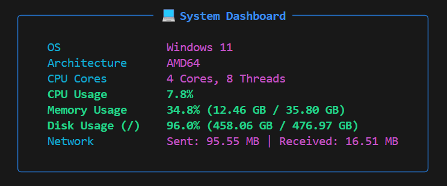

#  System Dashboard CLI

A modern, cross-platform, and polished command-line tool to display your system's information and live statistics. Built with Python, [Typer](https://typer.tiangolo.com/), [psutil](https://github.com/giampaolo/psutil), and [Rich](https://github.com/Textualize/rich).

This project serves as a great example of how to build a practical and beautiful CLI application.



##  Features

- **Cross-Platform:** Works seamlessly on Windows, macOS, and Linux.
- **Live Updates:** Use the `--watch` or `-w` flag to see your stats refresh in real-time without flicker.
- **Clean & Modern UI:** Uses the Rich library to present data in a beautiful, easy-to-read panel with colors and formatting.
- **Comprehensive Info:** Displays key system metrics at a glance:
  - Operating System & Architecture
  - CPU Cores & Live Usage Percentage
  - Virtual Memory (RAM) Usage
  - Root Disk Partition Usage
  - Total Network I/O (Sent & Received)

##  Installation

You will need Python 3.7+ installed on your system.

1.  **Clone the repository:**
    ```bash
    git clone https://github.com/your-username/sys-dashboard.git
    ```

2.  **Navigate into the project directory:**
    ```bash
    cd sys-dashboard
    ```

3.  **Create and activate a virtual environment (recommended):**
    ```bash
    # For macOS/Linux
    python3 -m venv venv
    source venv/bin/activate

    # For Windows
    python -m venv venv
    .\venv\Scripts\activate
    ```

4.  **Install the project in editable mode:**
    This will install all necessary dependencies and make the `sys-dashboard` command available in your shell (while the virtual environment is active).
    ```bash
    pip install -e .
    ```

## Usage

Once installed, you can use the `sys-dashboard` command directly from your terminal.

#### Display a one-time snapshot of your system:
```bash
sys-dashboard
```

#### Run in live-updating "watch" mode:
The dashboard will refresh every second until you stop it with `Ctrl+C`.
```bash
sys-dashboard --watch
```
You can also use the shorthand:
```bash
sys-dashboard -w
```

##  Built With

- **[Python](https://www.python.org/)** - The core programming language.
- **[Typer](https://typer.tiangolo.com/)** - For creating a powerful and user-friendly command-line interface with options and help text.
- **[psutil](https://github.com/giampaolo/psutil)** - For accessing system details and live utilization statistics in a cross-platform way.
- **[Rich](https://github.com/Textualize/rich)** - For rendering beautiful, responsive tables, panels, and colored text in the terminal.

---

*This project was created as a fun and practical way to learn CLI development. Feel free to fork, modify, and use it as a template for your own ideas!*